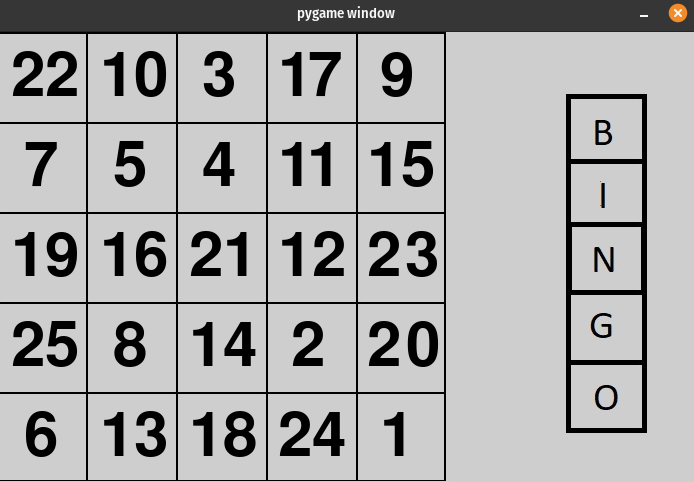

# Bingo-Multiplayer-Game

Implementation of Bingo **multiplayer game** 
in python with module [**pygame**](https://www.pygame.org/)

- Requirement
    1. Python 3.7 or Higher
    1. Pygame
        - `pip install pygame `

## Screenshot

---

### Note
run `server.py` first    
    
